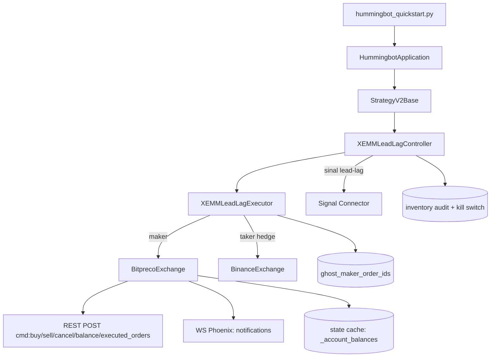

# Project Map

> **Audiência:** agentes Claude Code (e devs humanos) que precisam orientação rápida antes de mexer no projeto.
> **Atualizado em:** 2026-05-14
> **Branch ativa:** `claude/xemm-leadlag`
>
> Este documento descreve a estrutura real do repositório e onde mexer
> para cada tipo de tarefa. **Atualize este arquivo quando alterar
> estrutura, fluxo de execução, conectores, controllers ou executors.**
> Tudo marcado como _"não confirmado"_ exige verificação direta no
> código antes de virar premissa.

---

## 1. Visão geral

Fork do [Hummingbot](https://hummingbot.org) focado em **um único bot
de market-making cross-exchange (XEMM)** para o par **BTC-BRL**.

- **Maker leg:** BitPreco (exchange brasileira, conector custom neste fork)
- **Taker leg / hedge:** Binance (`binance` connector upstream)
- **Sinal lead-lag sintético:** combinação BTC-USDT × USDT-BRL em terceiro
  connector, usado **apenas para ajustar profitability e disparar cancel**
  — nunca como hedge.
- **Estratégia:** controller V2 `XEMMLeadLagController` orquestra
  executors `XEMMLeadLagExecutor`. Cada executor representa um ciclo
  maker → fill → hedge → terminated.
- **Risco controlado por:** profitability gates (min/target/max), kill
  switch via arquivo (`/tmp/xemm_lead_lag_pause`), inventory audit com
  drift quote em BRL, balance gate, circuit breakers de PnL e watchdog.

O resto do código upstream do Hummingbot (centenas de connectors, controllers
direcionais, etc.) **existe mas não é usado em produção** — não modificar
fora do escopo abaixo sem motivo explícito.

---

## 2. Stack e dependências principais

- **Linguagem:** Python 3.13 + Cython (`.pyx`/`.pxd` compilados in-place
  via `setup.py build_ext --inplace`).
- **Gerenciador de env:** Conda (`hummingbot`). Arquivo:
  `setup/environment.yml`. Pip extras em `setup/pip_packages.txt`.
- **Framework:** Hummingbot V2 (`strategy_v2/`) — modelo
  Controller + Executor + Runnable.
- **Async I/O:** `asyncio`. Eventos entre connectors e executors via
  `SourceInfoEventForwarder`.
- **HTTP / WS:** Hummingbot `web_assistants` (REST + WSAssistant); auth
  por HMAC (BitPreco).
- **Persistência:** SQLite local em `data/conf_xemm_lead_lag_sbe.sqlite`
  (tabelas: `TradeFill`, `Order`, `Executors`, `Controllers`,
  `MarketData`, `Position`, ...).
- **Tooling de dev (2026-05-14):**
  - Lint: **`ruff`** (substitui `flake8` no pre-commit). Config em
    `pyproject.toml[tool.ruff]`.
  - Format autofix: `autopep8` (ainda no pre-commit, somente fixes).
  - Type check: **`pyright`** modo `basic`, escopo restrito em
    `pyrightconfig.json` (só bitpreco/xemm_executor).
  - Property tests: **`hypothesis`**.
  - MCP: **`sqlite-xemm`** (servidor SQLite apontando para o
    `.sqlite` acima) — usar SQL ao invés de `grep` em `trades.jsonl`.
- **Bibliotecas notáveis:** `pydantic` (v2, com avisos legacy em
  `foxbit_utils.py`), `numpy>=2.2.6`, `cython>=3.0.12`,
  `pandas` (indireto), `pytest-asyncio`.

---

## 3. Estrutura de diretórios

### Raiz

| Caminho | Responsabilidade | Quando olhar |
|---|---|---|
| `bin/` | Pontos de entrada do bot (`hummingbot_quickstart.py`) | Quando depurar boot/CLI |
| `hummingbot/` | Código-fonte do framework | Sempre; é o produto |
| `controllers/` | Controllers V2 (orquestração de executors) | Mudanças de estratégia/risco |
| `scripts/` | Estratégias standalone (legado V1 + utilitários) | Raramente; só `simple_xemm.py` referência |
| `test/` | Testes (`pytest`), espelha estrutura de `hummingbot/` | Antes de qualquer PR |
| `setup/` | `environment.yml`, `pip_packages.txt` | Mudanças de deps |
| `tools/` | Helpers de operação (heartbeat, monitor scripts) | Configurar monitoramento |
| `conf/` | Configurações em runtime (yml dos controllers, fees, etc.) | Ajustar parâmetros de bot |
| `data/` | SQLite + estado serializado do bot (não versionado) | Inspeção via MCP `sqlite-xemm` |
| `logs/` | Logs do runtime (não versionado) | Debug pós-mortem |
| `docs/` | Documentação interna (este arquivo) | Onboarding |
| `gateway/` | Gateway DeFi (não usado neste fork) | Ignorar |
| `documentation/` | Docs upstream (Mkdocs) | Ignorar para o escopo XEMM |

### `hummingbot/connector/exchange/bitpreco/`

| Arquivo | Responsabilidade |
|---|---|
| `bitpreco_exchange.py` | Conector principal: place/cancel order, balance, fill detection, user-stream hooks. **Coração financeiro.** |
| `bitpreco_api_user_stream_data_source.py` | WebSocket real (Phoenix-frame); reconnect catch-up via REST |
| `bitpreco_api_order_book_data_source.py` | Order book poller REST (500ms) — **não WS**, apesar do nome |
| `bitpreco_auth.py` | HMAC para requests privados |
| `bitpreco_constants.py` | Endpoints, rate limits, `ORDER_STATE`, GONE_CODES, env-routing |
| `bitpreco_web_utils.py` | Builder de requests + factory de WebAssistants |
| `bitpreco_order_book.py` | Subclasse de OrderBook para depth events |
| `bitpreco_utils.py` | Config schema + fee defaults |

### `hummingbot/strategy_v2/executors/xemm_executor/`

| Arquivo | Responsabilidade |
|---|---|
| `xemm_executor.py` | **Base** XEMMExecutor (LIMIT). Lifecycle, dispatch RUNNING→SHUTTING_DOWN→TERMINATED |
| `xemm_lead_lag_executor.py` | Variante LIMIT_MAKER + ghost-fill guard + balance revalidation + lead-aware placement |
| `data_types.py` | `XEMMExecutorConfig`, `XEMMLeadLagExecutorConfig` (campos: order_amount, profitability bounds, lead_signal_bps, etc.) |
| `__init__.py` | Package marker |

### `controllers/generic/`

| Arquivo | Responsabilidade |
|---|---|
| `xemm_lead_lag.py` | **Controller principal.** Cria executors, computa sinal lead-lag, audit de inventário, kill-switch, ghost-order registry |
| `xemm_lead_lag_example.yml` | Config-exemplo do controller |
| `xemm_multiple_levels.py` | Variante multi-níveis (não usada em prod neste fork) |

### `conf/controllers/`

| Arquivo | O que é |
|---|---|
| `xemm_lead_lag_btc_brl.yml` | Config de produção (canônica) |
| `xemm_lead_lag_btc_brl_sbe.yml` | Variante "SBE" (não confirmado o significado — verificar comentários no yml) |

### `test/hummingbot/connector/exchange/bitpreco/`

Suite ampla. Arquivos relevantes listados em §10.

### `test/hummingbot/strategy_v2/executors/xemm_executor/`

| Arquivo | O que cobre |
|---|---|
| `test_xemm_executor.py` | Base executor |
| `test_xemm_lead_lag_executor.py` | Lead-lag: ghost-fill, reconciliação |
| `test_xemm_revalidate_balance.py` | Gate de balance revalidation (Opção 3a, 2026-05-14) |

---

## 4. Pontos de entrada e fluxo de execução

### Inicialização do processo

1. **Shell** → `bin/hummingbot_quickstart.py` (ou `make run`)
2. Quickstart parseia args, importa `bin/hummingbot.py`, instancia
   `HummingbotApplication`, monta UI (curses-based).
3. UI carrega o **script** ou **controller-set** configurado em
   `conf/`. Para nosso bot: usa o controller `xemm_lead_lag` apontando
   para `conf/controllers/xemm_lead_lag_btc_brl_sbe.yml`.
4. `StrategyV2Base` (genérico) instancia os connectors (`bitpreco`,
   `binance`, signal connector), cria o `XEMMLeadLagController`,
   começa a chamar `control_task()` a cada tick.

### Tick principal (controller)

`XEMMLeadLagController.determine_executor_actions()` (em
`controllers/generic/xemm_lead_lag.py`):

1. Audit: lê PnL, drift, kill-switch, watchdog → pode pausar.
2. Atualiza sinal lead-lag (`processed_data.best_lead_bps`) a partir
   dos preços do signal connector.
3. Decide: criar novo executor, manter o vivo, ou solicitar shutdown.
4. Retorna lista de `CreateExecutorAction` / `StopExecutorAction`.

### Tick principal (executor)

`XEMMLeadLagExecutor.control_task()` (herda de `XEMMExecutor`):

```
if status == RUNNING:
    update_prices_and_tx_costs()   # taker_result_price, tx_cost_pct
    control_maker_order()          # cancela stale, cria novo, detecta fill
elif status == SHUTTING_DOWN:
    control_shutdown_process()     # garante hedge e cancela maker pendente
```

### Caminho do dinheiro (maker fill)

1. BitPreco fecha um match → cliente REST não sabe ainda.
2. Detecção via uma de **três** vias (em ordem de latência crescente):
   a. **Resposta síncrona do place** (`ORDER_FULLY_EXECUTED` /
   `ORDER_PARTIALLY_EXECUTED` no body do POST `buy`/`sell`) →
   `_emit_synchronous_fill()` / `_cancel_partial_and_emit_final()`.
   b. **Resposta do cancel** (desde 2026-05-14, payload traz
   `exec_amount`/`cost` no root) → `_try_emit_fill_from_cancel_response()`.
   c. **Poll REST `executed_orders`** → `_emit_fills_with_retry()`
   (último recurso).
3. Connector publica `OrderFilledEvent` no event bus.
4. `XEMMExecutor.process_order_completed_event` → status =
   `SHUTTING_DOWN` → `place_taker_order()` na Binance (MARKET,
   quantizado ao LOT_SIZE).
5. Após taker concluir → `stop()` → status = `TERMINATED`.
6. Controller cria novo executor no próximo tick.

### Caminho do ghost fill (race do cancel)

Cancel volta `success=False / CANT_CANCEL_FILLED_ORDER` mas a base
limpa a referência ao maker_order antes do fill aparecer:

- `XEMMLeadLagExecutor.process_order_canceled_event` registra o
  `order_id` em `_ghost_maker_order_ids` e chama
  `controller.register_ghost_order()`.
- Quando o fill chega tarde, `process_order_completed_event` dispara o
  hedge MARKET diretamente (sem passar por `place_taker_order` da
  base, que precisa do `maker_order` populado).

---

## 5. Módulos críticos

### `hummingbot/connector/exchange/bitpreco/bitpreco_exchange.py` (CRÍTICO)

Classe `BitprecoExchange`. Métodos principais agrupados:

**Lifecycle / Balance**
- `_update_balances(_trigger)` — POST `balance`; atualiza
  `_account_balances` e `_account_available_balances`.
- `_reconcile_balance_on_rejection(msg, response)` — Em
  `NOT_ENOUGH_USER_BALANCE`, atualiza cache imediatamente com o
  campo `max` autoritativo da exchange, e dispara refresh async em
  background.
- `_post_fill_balance_refresh()` — Refresh debounced (dois flags:
  in-flight + queued) após qualquer fill emitido.

**Order placement**
- `_place_order(...)` — Decide `buy`/`sell`, formata preço (BTC-BRL:
  floor para BUY, ceil para SELL), envia REST. Em sucesso síncrono
  com fill, dispara emissão. Em rejeição, dispara reconcile de saldo.
- `_place_cancel(order_id, tracked_order)` — Cancel com retry; espera
  até 1.5s se ainda PENDING_CREATE; interpreta `GONE_CODES` e
  `GONE_BY_FILL_CODES`; chama o fast-path de emissão se houver dados
  no payload.

**Fill detection**
- `_emit_synchronous_fill(...)` — Caminho síncrono do place.
- `_emit_fills_with_retry(...)` — Fallback via REST `executed_orders`
  com backoff exponencial.
- `_try_emit_fill_from_cancel_response(...)` — Fast-path do cancel
  (sem REST extra); valida `exec_amount > 0` e `cost > 0`.
- `_all_trade_updates_for_order(...)` — Constrói TradeUpdates a
  partir do array `executed_orders`. **Cuidado com timezone:** payload
  é São Paulo BRT, não UTC (fix de 2026-05-13).

**User stream**
- `_user_stream_event_listener()` — consome a queue do WS; em evento
  `flash`, atualiza balance + status (sleep 0.5s entre eles para
  evitar miss).

### `hummingbot/strategy_v2/executors/xemm_executor/xemm_lead_lag_executor.py` (CRÍTICO)

Classe `XEMMLeadLagExecutor`. Pontos-chave:

- `create_maker_order()` — Início: `validate_sufficient_balance()`
  (gate da Opção 3a, 2026-05-14). Calcula preço com sinal
  lead-aware e arredonda para dentro do cancel band.
- `place_taker_order(amount)` — Hedge MARKET na taker; **quantiza ao
  LOT_SIZE da Binance** para evitar undershoot silencioso.
- `control_maker_order()` — Loop de manutenção. Detecta fill antes da
  base limpar referência; dispara hedge cedo se necessário.
- `process_order_canceled_event` / `process_order_completed_event` —
  Ghost-fill handling (ver §4).
- `validate_sufficient_balance()` — Construção de `OrderCandidate` com
  `is_maker=True, order_type=LIMIT_MAKER`; se ajustado virar zero,
  `stop()` com `INSUFFICIENT_BALANCE`.

### `controllers/generic/xemm_lead_lag.py` (CRÍTICO)

Classe `XEMMLeadLagController`. Pontos-chave (line numbers aproximadas):

- **Inventory audit:** drift quote em BRL; ação configurável
  (`pause` / `alert` / `auto_rebalance`).
- **Kill-switch file polling:** se `kill_switch_file` existir, pausa.
- **Lead signal:** janelas configuráveis (`lead_windows_seconds:
  [5, 10, 15]`); computa `best_lead_bps` em `processed_data`.
- **Ghost-order registry:** `register_ghost_order()` e
  `mark_ghost_hedged()` para dedup cross-executor.

---

## 6. Fluxos de negócio / fluxos técnicos

### 6.1 Inicialização

`bin/hummingbot_quickstart.py` → `HummingbotApplication.start()` →
`StrategyV2Base.start()` → `controller.start()` → tick loop.

### 6.2 Leitura de configuração

- Bot-level: `conf/conf_client.yml`, `conf/conf_fee_overrides.yml`.
- Controller-level: `conf/controllers/xemm_lead_lag_btc_brl_sbe.yml`.
- Connectors: keys em `conf/connectors/*.yml` (encrypted).
- Não há `.env`. Variáveis sensíveis ficam encrypted via keyring do
  Hummingbot.

### 6.3 Processamento principal

Loop event-driven assíncrono (ver §4). Ticks típicos: controller
~1s, executor `control_task` mesma cadência herdada.

### 6.4 Comunicação com APIs externas

**REST BitPreco** — todos os requests vão para o mesmo endpoint
(`CONSTANTS.REST_URL`) com campo `cmd` variando:

| `cmd` | Quando |
|---|---|
| `balance` | Periódico 5s + post-fill + post-rejection |
| `buy` / `sell` | `_place_order` |
| `order_cancel` | `_place_cancel` |
| `executed_orders` | Fallback fill detection |

**WS BitPreco** — Phoenix WSS, drops esperados a cada ~70-90s.
Reconnect dispara catch-up REST em todas as in-flight orders.

**REST Binance** — connector upstream (não modificado).

**Routing por env vars:**
`BITPRECO_INTERNAL_API`, `BITPRECO_INTERNAL_BOOKS`,
`BITPRECO_TRADING_URL`, `BITPRECO_ORDER_BOOK_URL`. Ver
`bitpreco_constants.py:38-66`.

### 6.5 Persistência

- **SQLite local** (`data/conf_xemm_lead_lag_sbe.sqlite`): histórico
  de fills/orders/executores, escrito pelo framework. Read via MCP.
- **⚠ Armadilha de escala em `TradeFill`:** `amount` e `price` são
  armazenados como **inteiros escalados por 1e6** (ex: `amount=201` =
  0.000201 BTC; `price=399838998263` = 399 838.998 BRL). Qualquer
  query de notional precisa dividir por `1e12` (amount × price).
- **`state.json`**: atualizado **apenas em fills** (memo importante —
  não usar mtime para liveness; usar heartbeat).
- **`trades.jsonl`**: append-only de fills (NDJSON).
- **`last_fill.touch`**: arquivo tocado em cada fill para audit.

### 6.6 Tratamento de erro

- Erros de placement: `OrderNotCreatedError` com `message_cod`. Códigos
  conhecidos viram caminhos específicos (ex:
  `NOT_ENOUGH_USER_BALANCE` → reconcile).
- Erros de cancel: `GONE_CODES` e `GONE_BY_FILL_CODES` tratados como
  estados terminais legítimos.
- Falha de rede: web_assistants já tem retry interno. WS reconnect
  automático com catch-up REST.
- Timeout em fills: `_emit_fills_with_retry` (3 attempts, 0.2s backoff).
- Stale cache de saldo: combinação de periódico 5s + post-fill async
  + sync update no `max` de rejeição.

### 6.7 Testes

Ver §10.

---

## 7. Mapa de dependências

```
StrategyV2Base
    └─ XEMMLeadLagController (controllers/generic/xemm_lead_lag.py)
        ├─ usa: BitprecoExchange (maker)
        ├─ usa: BinanceExchange (taker)
        ├─ usa: 3rd connector (signal)
        └─ cria: XEMMLeadLagExecutor
                    ├─ extends XEMMExecutor
                    │    └─ extends ExecutorBase
                    │         └─ extends RunnableBase
                    ├─ usa: connectors do controller
                    └─ usa: data_types.XEMMLeadLagExecutorConfig

BitprecoExchange (hummingbot/connector/exchange/bitpreco/bitpreco_exchange.py)
    ├─ BitprecoAuth (HMAC)
    ├─ BitprecoUserStreamDataSource (WS Phoenix)
    ├─ BitprecoAPIOrderBookDataSource (REST poll)
    ├─ bitpreco_constants (ORDER_STATE, GONE_CODES, env routing)
    └─ bitpreco_web_utils (request factory)
```



---

## 8. Onde alterar para cada tipo de tarefa

| Tarefa | Arquivos prováveis | Riscos | Testes recomendados |
|---|---|---|---|
| Ajustar profitability/thresholds | `conf/controllers/xemm_lead_lag_btc_brl_sbe.yml` | Erro de % vs BPS; misaligned com min_profitability | Smoke local + monitorar 1h |
| Mudar lógica do sinal lead-lag | `controllers/generic/xemm_lead_lag.py` (`processed_data` block) | Decisão de cancel/profitability errada → exposição direcional | `test_xemm_lead_lag_executor.py` + integração local |
| Detecção de fill (cancel response) | `bitpreco_exchange.py::_try_emit_fill_from_cancel_response` | **Ordem duplicada** se trade_id colidir; **fill perdido** se return False errado | `test_bitpreco_cancel_response_fill.py`, `test_bitpreco_cancel_response_properties.py` |
| Detecção de fill (REST fallback) | `bitpreco_exchange.py::_emit_fills_with_retry`, `_all_trade_updates_for_order` | **Timezone:** BRT vs UTC. **Fill perdido** se match exchange_order_id falhar | `test_bitpreco_cancel.py` (legacy fallback), suites de connector |
| Balance cache | `bitpreco_exchange.py::_update_balances`, `_reconcile_balance_on_rejection`, `_post_fill_balance_refresh` | **Saldo errado → over-leverage**. Não inflar para baixo | `test_bitpreco_balance_reconcile.py`, `test_bitpreco_post_fill_refresh.py` |
| Place order (placement / preço) | `bitpreco_exchange.py::_place_order`; quantize: `xemm_lead_lag_executor.py::create_maker_order` | **LIMIT_MAKER rejection** se preço cruzar; **rounding** errado quebra cancel band | `test_xemm_lead_lag_executor.py`, integração |
| Hedge / taker | `xemm_lead_lag_executor.py::place_taker_order` | **LOT_SIZE truncation** → drift; **hedge errado** → exposição | `test_xemm_executor.py`, `test_xemm_lead_lag_executor.py` |
| Cancel + race ghost-fill | `bitpreco_exchange.py::_place_cancel`, `xemm_lead_lag_executor.py::process_order_canceled_event` | **Double-hedge** se dedup falhar; **fill perdido** se ghost registry não disparar | `test_bitpreco_cancel.py`, `test_xemm_lead_lag_executor.py` |
| User stream / WS | `bitpreco_api_user_stream_data_source.py`, `_user_stream_event_listener` | Reconnect storm; **catch-up REST** ausente → status drift | manual + logs `[ws_lifecycle]`, `[ws_catchup]` |
| Inventory audit / kill switch | `controllers/generic/xemm_lead_lag.py` (audit, kill-file) | **Pausa errada** (false positive) ou **continua errado** (false negative) | smoke + cenários manuais (`touch /tmp/xemm_lead_lag_pause`) |
| Adicionar campo de config | `xemm_executor/data_types.py` + controller + yml | Backward-compat; default deve ser seguro (no-op) | unit + carregar yml em local |
| Novo endpoint BitPreco | `bitpreco_constants.py` + `bitpreco_exchange.py` | Rate limit; throttler; auth | `test_bitpreco_*` específico + smoke |
| Mudança que afeta SQLite schema | Não fazer manualmente — schema é do framework. Migração via Hummingbot | Corrupção de histórico | (não aplicar diretamente; nunca alterado neste fork) |

---

## 9. Áreas sensíveis

**Mudança errada nestas áreas pode causar perda financeira direta.**
Pedir review humano antes de merge, sempre.

| Área | Onde mora | Risco específico |
|---|---|---|
| **Hedge / taker execution** | `xemm_lead_lag_executor.py::place_taker_order` e ghost-fill paths | Exposição direcional, hedge incorreto |
| **Fill emission (TradeUpdate)** | `bitpreco_exchange.py::_try_emit_fill_from_cancel_response`, `_emit_fills_with_retry`, `_all_trade_updates_for_order` | Ordem duplicada, fill perdido, preço médio errado |
| **Balance cache** | `_update_balances`, `_reconcile_balance_on_rejection`, `_post_fill_balance_refresh` | Over-leverage por saldo inflado; rejection loop |
| **Cálculo de preço / spread / fee** | `xemm_lead_lag_executor.py::create_maker_order`, `update_prices_and_tx_costs`, `_get_live_lead_bps` | Spread negativo → trade direto contra; rounding errado quebra LIMIT_MAKER |
| **Cancel race / ghost fill** | `process_order_canceled_event`, `_ghost_maker_order_ids`, `controller.register_ghost_order` | Double-hedge, cancelamento perdido |
| **Auth / HMAC** | `bitpreco_auth.py` | Auth fail = bot offline; assinatura errada = ordem inválida |
| **Rate limits** | `bitpreco_constants.py` (RATE_LIMITS), `bitpreco_web_utils.py` (throttler) | Bann temporário do IP, bot fica cego |
| **Serialização do payload** | `_place_order` (volume vs amount em MARKET BUY), `_place_cancel` (interpretação do exec_amount) | Ordem com tamanho errado; payload misread |
| **Concorrência** | `_post_fill_balance_refresh` (two-flag), ghost registry, `_user_stream_event_listener` | Race condition, refresh storm |
| **Reconexão WebSocket** | `bitpreco_api_user_stream_data_source.py` (`_post_reconnect_catch_up`) | Status drift; fill perdido se catch-up não rodar |
| **Kill switch / circuit breakers** | `controllers/generic/xemm_lead_lag.py` (audit, kill-file, watchdog, PnL breach) | Bot continua perdendo dinheiro com problema conhecido |
| **Timezone parsing** | `_all_trade_updates_for_order` (parse de `time_stamp` como BRT) | Fill com timestamp 10.8h fora; audit de latência distorcido |

---

## 10. Testes e validações

### Como rodar

```bash
# Suite focada (rápido)
conda activate hummingbot
pytest test/hummingbot/connector/exchange/bitpreco -x
pytest test/hummingbot/strategy_v2/executors/xemm_executor -x

# Suite completa (lento; muito conector mockado)
make test
```

### Mapa de cobertura

| Arquivo | Cobre |
|---|---|
| `test_bitpreco_balance_reconcile.py` | Sync balance-cache em rejeição |
| `test_bitpreco_post_fill_refresh.py` | Debouncing two-flag do refresh async |
| `test_bitpreco_cancel.py` | `_place_cancel` (PENDING_CREATE wait, GONE_CODES, retry) |
| `test_bitpreco_cancel_response_fill.py` | `_try_emit_fill_from_cancel_response` (todos os ramos) |
| `test_bitpreco_cancel_response_properties.py` | **Property** (hypothesis) sobre matemática Decimal `cost/exec_amount` |
| `test_bitpreco_partial_cancel.py` | `_cancel_partial_and_emit_final` |
| `test_bitpreco_sync_fill_recovery.py` | Race do tracker em `_emit_synchronous_fill` |
| `test_bitpreco_fetch_fresh_vwap.py` | Cálculo VWAP fresh do order book |
| `test_bitpreco_market_buy_volume.py` | MARKET BUY: cálculo de `volume` (BRL) com headroom |
| `test_bitpreco_internal_hosts.py` | Routing por env vars |
| `test_xemm_executor.py` | Base executor (LIMIT) |
| `test_xemm_lead_lag_executor.py` | Lead-lag completo + ghost-fill |
| `test_xemm_revalidate_balance.py` | Gate da Opção 3a (validate antes de cada place) |

### Por que **nunca** mandar ordem real em teste

- Todos os testes usam `MagicMock`/`AsyncMock` no `_order_tracker`,
  `_account_balances`, etc. Não há `requests_mock` apontando para
  endpoint real porque o connector é stubado direto.
- Para integração de verdade: rodar o bot em modo paper (não
  configurado neste fork ainda — não confirmado) ou usar a conta
  separada de SBE em produção com `target_amount` mínimo.

---

## 11. Convenções do projeto

- **Estilo:** Black (line-length 120), isort, autopep8. Ruff para
  lint (substituiu flake8 em 2026-05-14).
- **Type hints:** parciais. Pyright em modo `basic` só no escopo
  bitpreco/xemm — expandir aos poucos.
- **Decimal everywhere:** preço/quantidade/saldo sempre `Decimal`;
  nunca `float`. Property tests via hypothesis usam strings na
  construção para evitar IEEE-754.
- **Logging tags estruturadas:** `[bp_balance]`, `[bp_timing]`,
  `[ws_lifecycle]`, `[ws_event_seen]`, `[balance_refresh_post_fill]`,
  `[balance_reconcile_sync]`, `[ws_catchup]`, `[ghost_fill]`, etc.
  Use isso para grep, não procurar por texto livre.
- **Comentários inline:** muito densos nos arquivos
  bitpreco/xemm — leia-os ao tocar a área (referenciam datas de
  bugfix e razões).
- **Erros vs warnings:** rejeições de balance são **WARNING**
  (controller's gate é autoritativo); rejeições de auth/lookup são
  **ERROR**.
- **Não conjugar verbos em inglês como se fossem PT** (memo do
  usuário): evitar "tracka", "logar", "spawnar", etc.
- **Antes de implementar mudança não-trivial:** propor solução
  simples vs performática, deixar usuário escolher (memo do
  usuário).

---

## 12. Lacunas e dúvidas

- _Não confirmado:_ significado preciso de `_sbe` em
  `conf_xemm_lead_lag_sbe.sqlite` / `xemm_lead_lag_btc_brl_sbe.yml`.
  Provavelmente nome da conta-segregada (SBE = ???).
- _Não confirmado:_ a profundidade do controller `xemm_lead_lag.py`
  (linhas mencionadas pelos agentes ficam em ~1849+ para audit,
  3094+ para kill-switch) — confirmar antes de citar como source of
  truth.
- _Não confirmado:_ qual signal connector exato está configurado
  (Binance? Kraken?) — depende do yml ativo.
- _Não confirmado:_ existência de modo paper para integração.
- _Não confirmado:_ se o controller `xemm_lead_lag.py` é único arquivo
  ou foi splittado (ver tamanho e imports).
- _Pendente:_ docs Mkdocs do upstream em `documentation/` provavelmente
  têm cobertura conceitual de Controller/Executor — confirmar se vale
  manter um link.

---

## 13. Guia para futuros agentes

### Antes de tocar em qualquer coisa

1. **Leia primeiro, nesta ordem:**
   - Este arquivo (`docs/PROJECT_MAP.md`)
   - `CLAUDE.md` (memos do usuário + convenções)
   - `OPERATIONS.md` (runtime + debugging)
   - `DEVELOPMENT_STATUS.md` (estado atual)
   - Arquivo-alvo da mudança + seus testes
2. **Confirme assunções com leitura direta.** Os agentes anteriores
   podem ter alucinado line numbers ou nomes de método.
3. **Se a mudança envolve mais de um arquivo,** apresente _opção
   simples_ vs _opção robusta_ ao usuário antes de codar (memo
   explícito).

### Antes de codar

```bash
# Sempre rodar antes de pedir runtime:
pyright                                                # type check escopado
ruff check <path>                                      # lint
pytest -x test/<área>                                  # testes da área
```

### Consultas operacionais (estado do bot)

- Não use `cat`/`grep` em `trades.jsonl` para perguntas agregadas —
  use o **MCP `sqlite-xemm`** com SQL em `data/conf_xemm_lead_lag_sbe.sqlite`.
- Para liveness: `pgrep -fa hummingbot_quickstart | grep -v grep`.
- Para PnL/posições: query `TradeFill`, `Position`, `Executors`.

### O que NUNCA assumir

- Que **balance cache** está atualizado. Sempre considere staleness
  até 5s (poll periódico) ou até a próxima rejeição.
- Que **WS BitPreco** está conectado. Drops ~70-90s são normais;
  catch-up REST cobre.
- Que **mtime de `state.json`** indica bot vivo. Só atualiza em
  fills (memo do usuário).
- Que **`trade_id` sintético** (`= client_order_id`) é problema. Não
  é — framework dedupa por `trade_id` e o uso atual é consistente.
- Que **timestamp da BitPreco** é UTC. É **São Paulo BRT**.
- Que MARKET BUY usa `amount`. Usa **`volume`** (BRL), não `amount`.

### Como validar uma mudança

1. **Unit:** testes da área passam (`pytest -x`).
2. **Type:** `pyright` sem erros novos no escopo.
3. **Lint:** `ruff check` clean.
4. **Smoke:** rodar local com `target_amount` mínimo ou config
   paper (não confirmado) e monitorar via `[bp_timing]`/`[bp_balance]`
   tags.
5. **Operação:** ler `OPERATIONS.md §8` para protocolo de
   monitoramento contínuo se a mudança vai para produção.

### Como atualizar este documento

Quando você mudar:
- Estrutura de diretórios → §3
- Fluxo de execução → §4, §6
- Public surface de connector / executor / controller → §5
- Dependências cross-module → §7
- Padrão de tooling / testes → §10, §11

**Não deixe este arquivo apodrecer.** Vale mais ele estar 80%
correto e atualizado do que 100% mas desatualizado.
